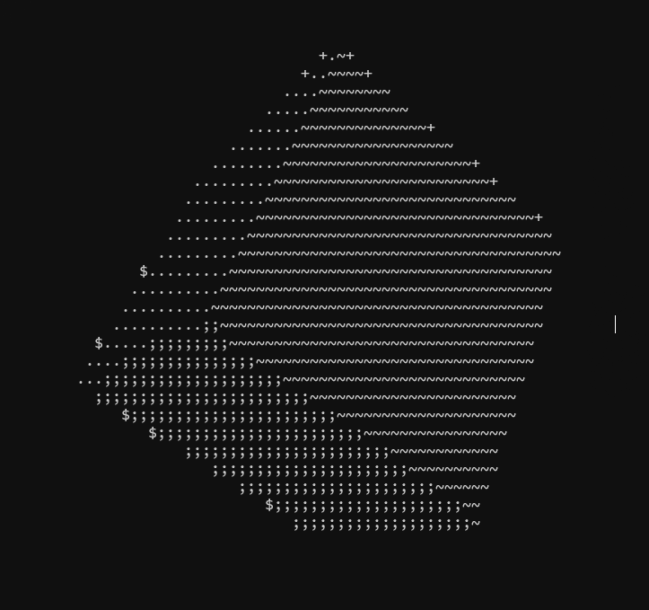

# 3D Rotating Cube in C

This project is a program that creates a 3D rotating cube on the screen using the C programming language.

## Features

The cube generated by this program is of variable size and is composed of six square faces. The cube is positioned at the center of the screen and moves in all directions while rotating on its own axis.

The program uses a ray casting-based rendering technique to determine the position and size of each of the pixels that form the final image. The result is a smooth and realistic animation of the moving cube.

## Requirements

To run this program, you need to have a C compiler and a graphics library compatible with the operating system installed. It is recommended to use a terminal or command prompt to compile and run the program.

## Instructions for Use

Download or clone the repository from GitHub.
Open a terminal or command prompt in the project directory.
Compile the program by executing the following command: ```gcc -lm cube.c -o cube```.<br>
Run the program with the following command: ```./cube``` .

## Visualization

Here is an image of the 3D rotating cube:



## Credits

This program was created by Kdex as part of a personal project. Its use, modification, and distribution are allowed under the terms of the [GPL License](https://en.wikipedia.org/wiki/GNU_General_Public_License "GPL License").